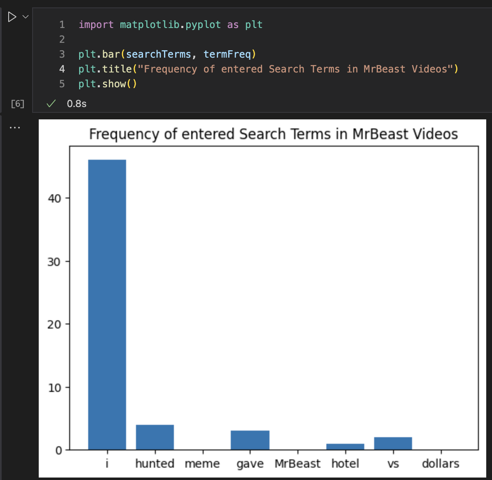
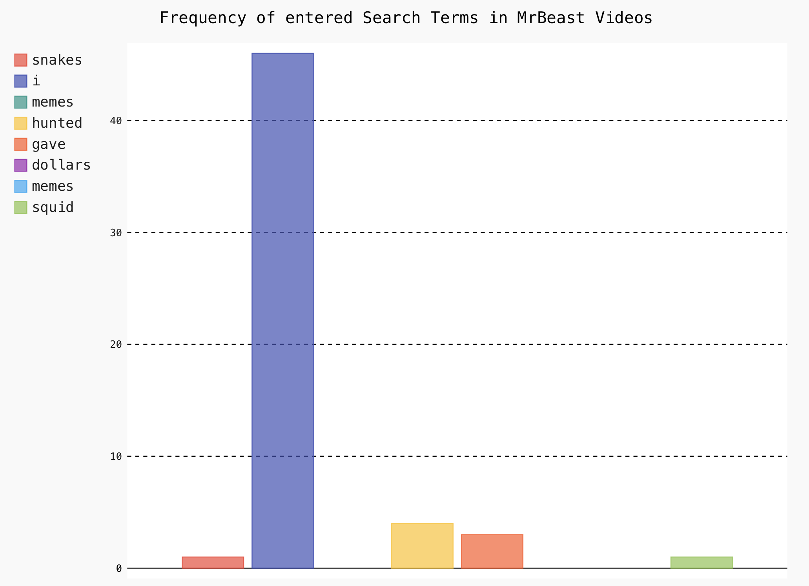
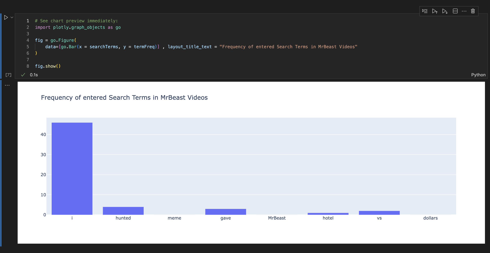

<h1>YouTube Search Grapher V0.02</h1>

<h2>What is this?</h2>

This is a simple program that allows you to search YouTube and graph the results. It is written in Python and uses <a href="http://matplotlib.org/">matplotlib</a> to graph the data- as well as some other options

<h2>How do I use it?</h2>

First, you will need a Google Developer account which are easily granted by going to <a href="https://developers.google.com">YouTube's API Homepage</a>. I have not used the Google API Python library so no need to install it.

To make the code pretty I've used a program called Jupyter Notebook. You can install it by running

<code>pip3 install jupyter</code> 

in your terminal. You can then run the program by running

<code>jupyter notebook</code>

in the directory of the program or by using the VSCode extension.

<h2>Limitations</h2>
<ul>
    <li>
Right now this script only works on a playlist not a channel because the API return for a channel is different. I will be adding that functionality soon.
</li>
    <li>
You have to enter in the code for the playlist within the script- and type in the name of the playlist while running. By default its set to a playlist of every MrBeast video.
</li>
    <li>
On top of ^ is that the name of the playlist has to be typed in manually- this should be an easy fix but I'm more focused on getting it to work on a channel.
</li>
</ul>

<h2>MatPlotLib</h2>

<h2>PyGal</h2>

<h2>Plotly</h2>
